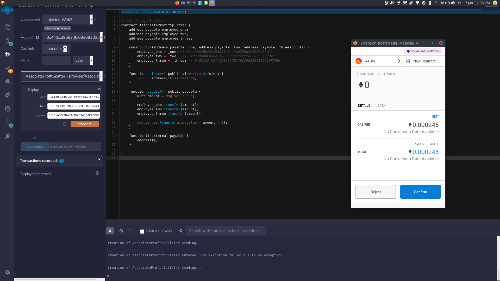
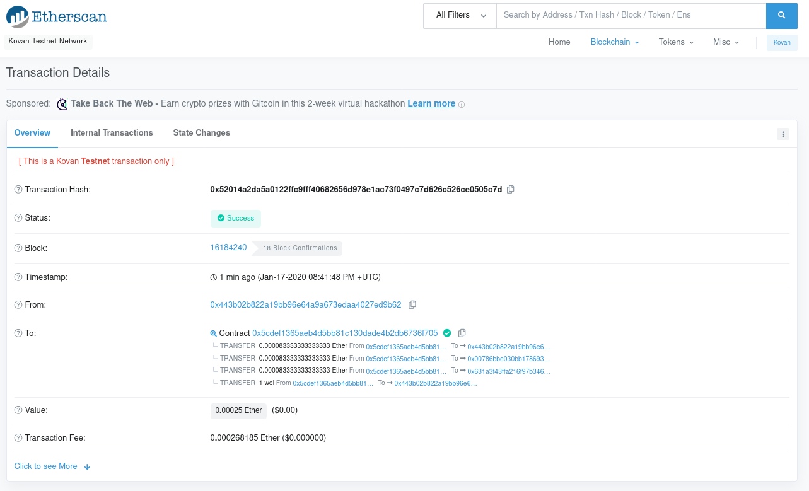
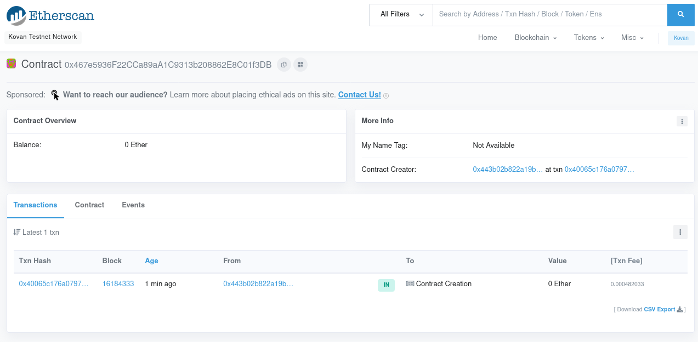
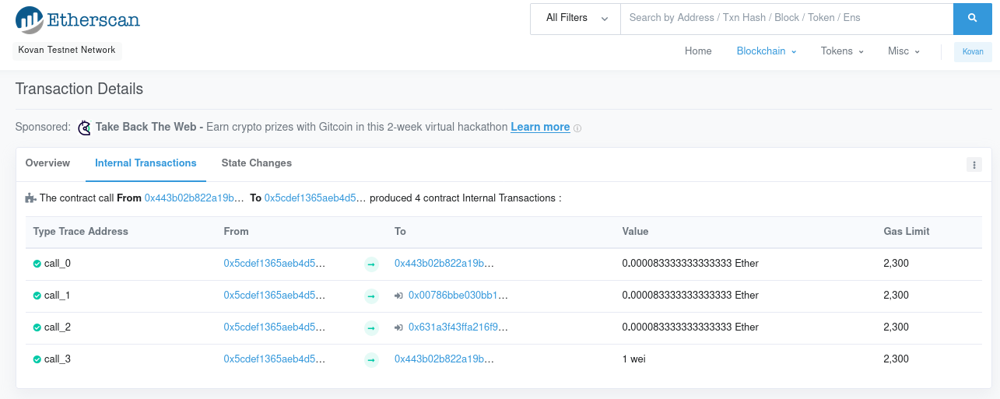

# Solidity Homework

Publish Contracts to Kovan Ethereum Testnet

## Contract Addresses (on Kovan) w/ Screen shots

1. [AssociateProfitSplitter](https://kovan.etherscan.io/tx/0xe2ac93fd489d90dcee4556918143320aa2be9e8626ce0c3099bf888068816e22)

   

   

2. [DeferredEquityPlan](https://kovan.etherscan.io/tx/0x40065c176a0797558afd40ff52032bf821dadac6f96c9ef4ddd540bece5e3ba9)
   

3. [TieredProfitSplitter](https://kovan.etherscan.io/tx/0xae06a57d1147447469c4781948e0e2bba90ae909ab2966ee9648b6bdd86664ae)
   

# Challenges

Difficult getting a screenshot of MetaMask for some reason (on Linux..)
